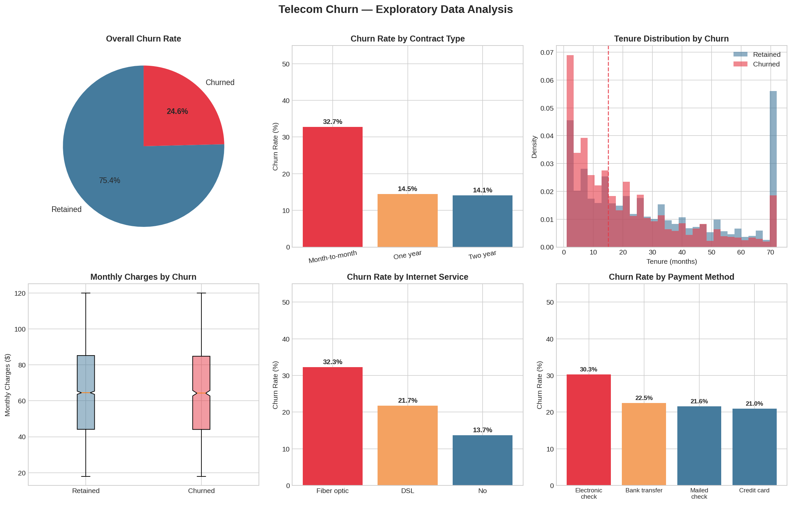
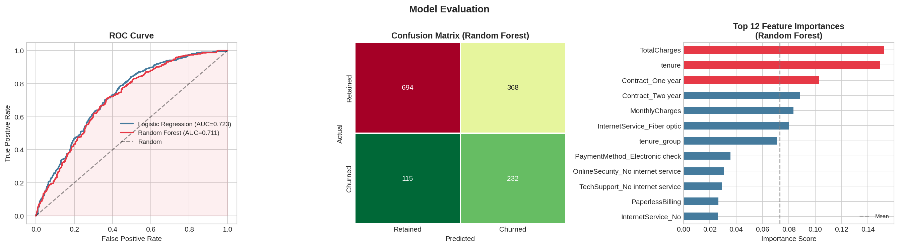

# Telecom Customer Churn Prediction

**Business Problem:** A telecom company loses revenue every time a customer churns. Acquiring a new customer costs 5-7x more than retaining an existing one. This project builds a classification model to identify at-risk customers before they leave — enabling targeted, proactive retention campaigns.

---

## Dataset

Synthetic dataset modeled after the [IBM Telco Customer Churn](https://www.kaggle.com/blastchar/telco-customer-churn) structure.

| Property | Value |
|---|---|
| Customers | 7,043 |
| Features | 21 |
| Churn Rate | ~24.6% |
| Target | `Churn` (1 = churned, 0 = retained) |

Key features include: contract type, tenure, monthly charges, internet service, payment method, online security, and tech support subscription.

---

## Approach

1. **Exploratory Data Analysis** — churn rates by contract type, internet service, payment method, tenure distribution
2. **Feature Engineering** — binary encoding, one-hot encoding, tenure bucketing
3. **Model Training** — Logistic Regression and Random Forest with class balancing
4. **Evaluation** — ROC-AUC, Precision-Recall, Confusion Matrix
5. **Business Interpretation** — Risk segmentation (Low / Medium / High) with revenue-at-risk quantification

---

## Results

| Model | ROC-AUC |
|---|---|
| Logistic Regression | 0.723 |
| Random Forest | 0.711 |

**Key findings from EDA:**
- Month-to-month contracts churn at ~3.5x the rate of two-year contracts
- Fiber optic customers churn significantly more than DSL customers
- Customers with tenure under 12 months are the highest-risk group
- Electronic check payment correlates with elevated churn

**Business output — Risk Segmentation:**

| Segment | Customers | Avg Churn Prob | Revenue at Risk |
|---|---|---|---|
| High Risk | 300 | 66% | $222,675/yr |
| Medium Risk | 763 | 46% | $586,047/yr |
| Low Risk | 346 | 21% | $280,216/yr |

Recommendation: Deploy retention offers (discounts, contract upgrades, free tech support) to the 300 high-risk customers. At an avg monthly charge of $61.85, preventing even 50% churn in this group saves ~$111K annually.

---

## EDA Plots



## Model Evaluation



---

## How to Run

```bash
git clone https://github.com/tugceumdu/churn-prediction
cd churn-prediction
pip install -r requirements.txt
python churn_analysis.py
```

---

## Tech Stack

- **Python** 3.10+
- **pandas**, **numpy** — data manipulation
- **scikit-learn** — modeling (Logistic Regression, Random Forest)
- **matplotlib**, **seaborn** — visualization

---

## Project Structure

```
churn-prediction/
├── churn_analysis.py      # Full pipeline: EDA, modeling, evaluation
├── eda_plots.png          # Exploratory data analysis visuals
├── model_evaluation.png   # ROC curve, confusion matrix, feature importance
├── requirements.txt
└── README.md
```

---

*Built as part of a business analytics portfolio. Dataset is synthetically generated to mirror the IBM Telco Churn benchmark.*
